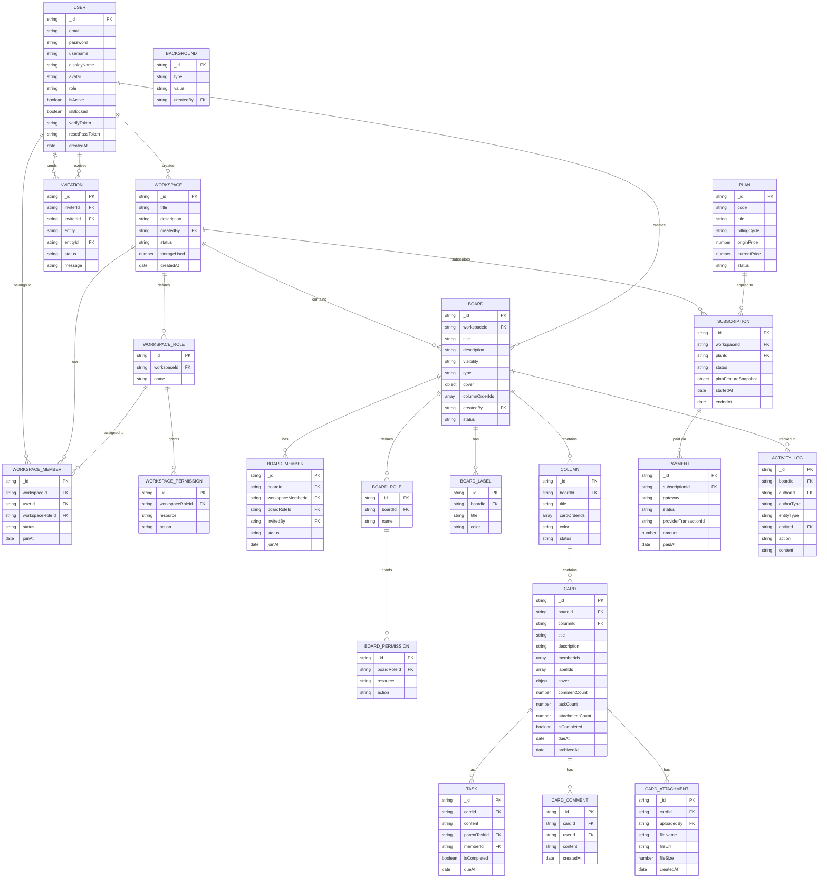

# Entity Relationship Diagram

Taskio data model — 22 collections (MongoDB → DynamoDB).

```mermaid
erDiagram
    USER {
        string _id PK
        string email
        string password
        string username
        string displayName
        string avatar
        string role
        boolean isActive
        boolean isBlocked
        string verifyToken
        string resetPassToken
        date createdAt
    }

    WORKSPACE {
        string _id PK
        string title
        string description
        string createdBy FK
        string status
        number storageUsed
        date createdAt
    }

    WORKSPACE_MEMBER {
        string _id PK
        string workspaceId FK
        string userId FK
        string workspaceRoleId FK
        string status
        date joinAt
    }

    WORKSPACE_ROLE {
        string _id PK
        string workspaceId FK
        string name
    }

    WORKSPACE_PERMISSION {
        string _id PK
        string workspaceRoleId FK
        string resource
        string action
    }

    BOARD {
        string _id PK
        string workspaceId FK
        string title
        string description
        string visibility
        string type
        object cover
        array columnOrderIds
        string createdBy FK
        string status
    }

    BOARD_MEMBER {
        string _id PK
        string boardId FK
        string workspaceMemberId FK
        string boardRoleId FK
        string invitedBy FK
        string status
        date joinAt
    }

    BOARD_ROLE {
        string _id PK
        string boardId FK
        string name
    }

    BOARD_PERMISSION {
        string _id PK
        string boardRoleId FK
        string resource
        string action
    }

    BOARD_LABEL {
        string _id PK
        string boardId FK
        string title
        string color
    }

    COLUMN {
        string _id PK
        string boardId FK
        string title
        array cardOrderIds
        string color
        string status
    }

    CARD {
        string _id PK
        string boardId FK
        string columnId FK
        string title
        string description
        array memberIds
        array labelIds
        object cover
        number commentCount
        number taskCount
        number attachmentCount
        boolean isCompleted
        date dueAt
        date archivedAt
    }

    TASK {
        string _id PK
        string cardId FK
        string content
        string parentTaskId FK
        string memberId FK
        boolean isCompleted
        date dueAt
    }

    CARD_COMMENT {
        string _id PK
        string cardId FK
        string userId FK
        string content
        date createdAt
    }

    CARD_ATTACHMENT {
        string _id PK
        string cardId FK
        string uploadedBy FK
        string fileName
        string fileUrl
        number fileSize
        date createdAt
    }

    INVITATION {
        string _id PK
        string inviterId FK
        string inviteeId FK
        string entity
        string entityId FK
        string status
        string message
    }

    PLAN {
        string _id PK
        string code
        string title
        string billingCycle
        number originPrice
        number currentPrice
        string status
    }

    SUBSCRIPTION {
        string _id PK
        string workspaceId FK
        string planId FK
        string status
        object planFeatureSnapshot
        date startedAt
        date endedAt
    }

    PAYMENT {
        string _id PK
        string subscriptionId FK
        string gateway
        string status
        string providerTransactionId
        number amount
        date paidAt
    }

    ACTIVITY_LOG {
        string _id PK
        string boardId FK
        string authorId FK
        string authorType
        string entityType
        string entityId FK
        string action
        string content
    }

    BACKGROUND {
        string _id PK
        string type
        string value
        string createdBy FK
    }

    USER ||--o{ WORKSPACE : "creates"
    USER ||--o{ WORKSPACE_MEMBER : "belongs to"
    WORKSPACE ||--o{ WORKSPACE_MEMBER : "has"
    WORKSPACE ||--o{ WORKSPACE_ROLE : "defines"
    WORKSPACE_ROLE ||--o{ WORKSPACE_PERMISSION : "grants"
    WORKSPACE_ROLE ||--o{ WORKSPACE_MEMBER : "assigned to"

    WORKSPACE ||--o{ BOARD : "contains"
    USER ||--o{ BOARD : "creates"
    BOARD ||--o{ BOARD_MEMBER : "has"
    BOARD ||--o{ BOARD_ROLE : "defines"
    BOARD_ROLE ||--o{ BOARD_PERMISSION : "grants"
    BOARD ||--o{ BOARD_LABEL : "has"
    BOARD ||--o{ COLUMN : "contains"
    BOARD ||--o{ ACTIVITY_LOG : "tracked in"

    COLUMN ||--o{ CARD : "contains"
    CARD ||--o{ TASK : "has"
    CARD ||--o{ CARD_COMMENT : "has"
    CARD ||--o{ CARD_ATTACHMENT : "has"

    USER ||--o{ INVITATION : "sends"
    USER ||--o{ INVITATION : "receives"

    WORKSPACE ||--o{ SUBSCRIPTION : "subscribes"
    PLAN ||--o{ SUBSCRIPTION : "applied to"
    SUBSCRIPTION ||--o{ PAYMENT : "paid via"
```
