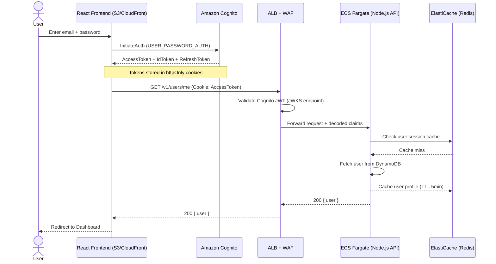
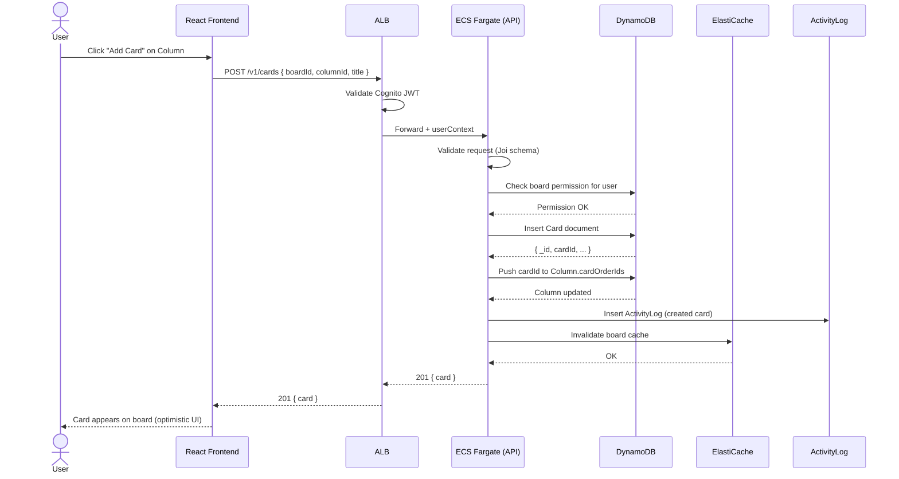
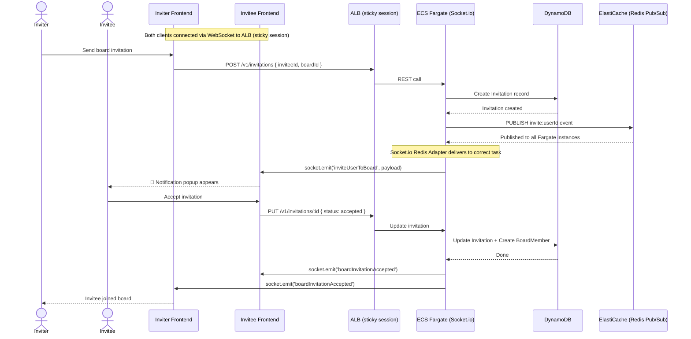
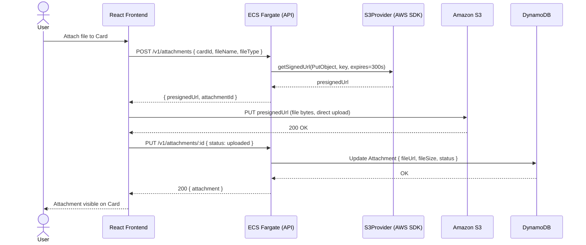

# Sequence Diagrams

Key interaction flows across the Taskio system.

---

## 1. User Authentication Flow (Cognito)

---

## 2. Create Card Flow (REST API)

---

## 3. Real-time Board Invitation (Socket.io)

---

## 4. File Upload Flow (S3 Presigned URL)

