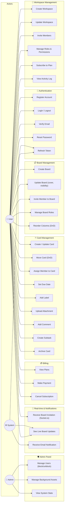

# Use Case Diagram

Taskio actors and system use cases — 34 use cases across 3 actors.

```mermaid
flowchart LR
    subgraph Actors
        U(("👤 User"))
        A(("🔧 Admin"))
        S(("⚙️ System"))
    end

    subgraph AUTH ["🔐 Authentication"]
        UC1["Register Account"]
        UC2["Login / Logout"]
        UC3["Verify Email"]
        UC4["Reset Password"]
        UC5["Refresh Token"]
    end

    subgraph WS ["🏢 Workspace Management"]
        UC6["Create Workspace"]
        UC7["Update Workspace"]
        UC8["Invite Members"]
        UC9["Manage Roles & Permissions"]
        UC10["Subscribe to Plan"]
        UC11["View Activity Log"]
    end

    subgraph BOARD ["📋 Board Management"]
        UC12["Create Board"]
        UC13["Update Board (cover, visibility)"]
        UC14["Invite Member to Board"]
        UC15["Manage Board Roles"]
        UC16["Reorder Columns (DnD)"]
    end

    subgraph CARD ["🃏 Card Management"]
        UC17["Create / Update Card"]
        UC18["Move Card (DnD)"]
        UC19["Assign Member to Card"]
        UC20["Set Due Date"]
        UC21["Add Label"]
        UC22["Upload Attachment"]
        UC23["Add Comment"]
        UC24["Create Subtask"]
        UC25["Archive Card"]
    end

    subgraph NOTIF ["🔔 Real-time & Notifications"]
        UC26["Receive Board Invitation (Socket.io)"]
        UC27["See Live Board Updates"]
        UC28["Receive Email Notification"]
    end

    subgraph ADMIN ["🛡️ Admin Panel"]
        UC29["Manage Users (block/unblock)"]
        UC30["Manage Background Assets"]
        UC31["View System Stats"]
    end

    subgraph PAY ["💳 Billing"]
        UC32["View Plans"]
        UC33["Make Payment"]
        UC34["Cancel Subscription"]
    end

    U --> UC1 & UC2 & UC3 & UC4 & UC5
    U --> UC6 & UC7 & UC8 & UC9 & UC10 & UC11
    U --> UC12 & UC13 & UC14 & UC15 & UC16
    U --> UC17 & UC18 & UC19 & UC20 & UC21 & UC22 & UC23 & UC24 & UC25
    U --> UC26 & UC27
    U --> UC32 & UC33 & UC34

    A --> UC29 & UC30 & UC31

    S --> UC28 & UC27 & UC5
```
